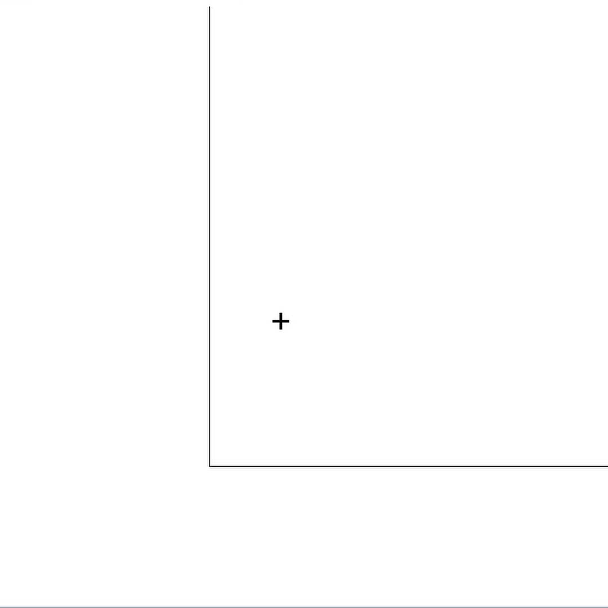

# p-note (Archived)
Program aimed at replacing onenote for me. It is archived for the following reasons:
1. unvolatile storage is currently a pain and bodgy. Should remake with some form of databse. (possibly sqlite or redis(implement spatialhash there?))
2. The combination of swing and javafx does not play nice enough. In particular the Webviewer crashes upon loading larger websites. Don't think there is a fix.

## 
Showcase

Panning the camera:

Swing component interaction:

Transform shapes:

